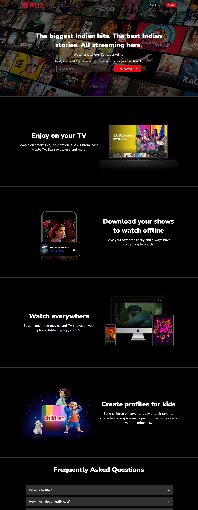

# 🎬 Netflix Home Clone

A clean and fully responsive front-end clone of the Netflix landing page and sign-in page, built using pure HTML and CSS. This project replicates the official look and feel of Netflix to practice modern UI design and responsive layout techniques.

## 🔗 Live Demo
👉 [View Live Site](https://yashgupta7373.github.io/Netflix-Clone/)

## 📂 GitHub Repository
👉 [GitHub Repo](https://github.com/yashgupta7373/Netflix-Clone)

## 🛠️ Tech Stack
- HTML5
- CSS3

## 📸 Screenshot


## ✨ Features
- Fully responsive Netflix-style landing page
- Professionally designed sign-in page
- Styled buttons, inputs, and layout sections
- Mobile-first design with adaptive responsiveness
- Clean UI with consistent branding and dark theme

## 💡 Purpose
This project was built to replicate the UI design of [Netflix](https://www.netflix.com/) using just HTML and CSS. It's ideal for improving layout skills, mastering responsive design, and practicing real-world UI implementation without using JavaScript or frameworks.

## 📁 Pages Included
- **Home Page** – Includes banner, headline, CTA, and layout structure
- **Sign-In Page** – Features styled input fields, buttons, and responsive form

## 🚀 How to Use
1. Clone the repository:
   ```bash
   git clone https://github.com/yashgupta7373/Netflix-Clone.git
2. Open index.html in your browser.

📌 Note
This is a static front-end UI project meant for educational and portfolio purposes only. It does not include any backend or authentication functionality.

Made with ❤️ by Yash Gupta